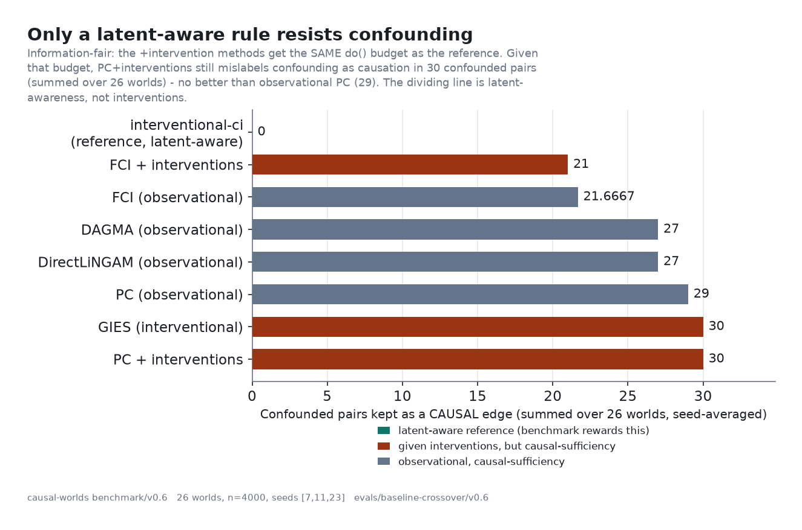
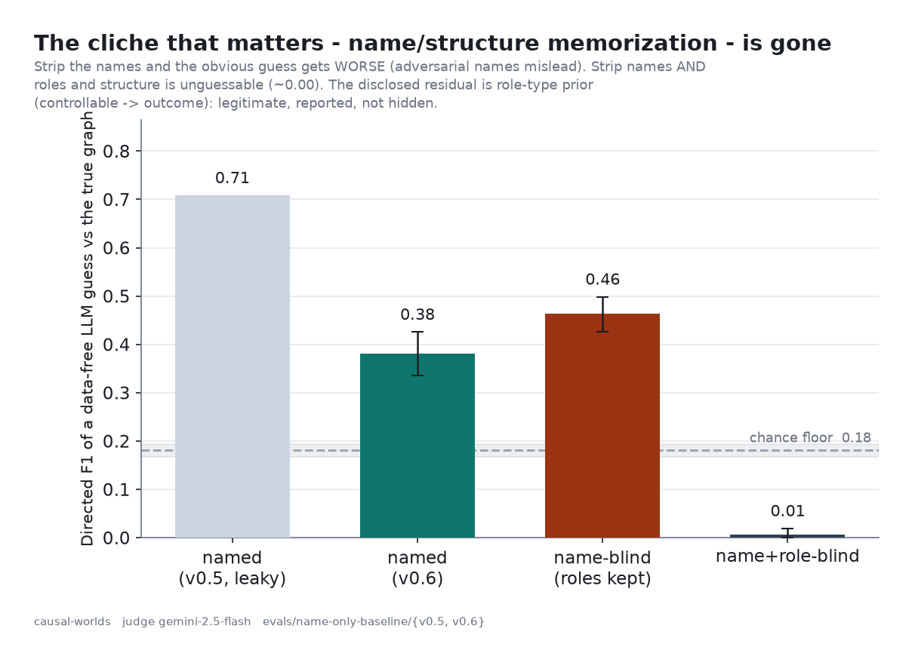

# Correlation lies. We built a causal world that can prove it — then tried to break it ourselves.

*Introducing [`causal-worlds`](https://github.com/noumenal-ai/causal-worlds) (MIT, `pip install
causal-worlds`): write a sentence, get a fictional-but-coherent causal world with a **declared
ground-truth answer key** — one you can see, intervene on, and ask counterfactuals of. Plus the honest
story of the flaws we found auditing our own work.*

---

## The whole problem, in two numbers

Here is a dataset from a small coffee chain. Two columns — `overtime` (staff hours) and `sales` — rise
and fall together: correlation **0.64**. Any analyst would conclude that overtime drives sales.

Now don't *watch* overtime — *set* it. Force it high, force it low, and measure what `sales` does. The
effect is **0.00**.

```python
import numpy as np
from causal_worlds import build_substrate, worlds

sub = build_substrate(worlds.get("coffee"), standardize=False)
ov, sa = sub.variables.index("overtime"), sub.variables.index("sales")

seen = sub.sample(40_000, seed=0).data
corr = np.corrcoef(seen[:, ov], seen[:, sa])[0, 1]                     # ≈ 0.64  → looks causal
hi = sub.sample(40_000, seed=1, do={"overtime":  1.0}).data[:, sa].mean()
lo = sub.sample(40_000, seed=1, do={"overtime": -1.0}).data[:, sa].mean()
print(round(corr, 2), round((hi - lo) / 2, 2))   # 0.64  0.00  → strong correlation, ZERO causal effect
```

There is no causal link between overtime and sales. The entire correlation is an unobserved *local
buzz* — a street festival, good weather, a nearby event — that lifts foot traffic, staff overtime, and
sales all at once. Here is the world, with that hidden confounder drawn dashed in red, exactly the
structure a discovery method never gets to see:


The point isn't that correlation ≠ causation — you knew that. The point is that **we declared the buzz,
so the benchmark *knows* the right answer and can score who gets fooled.** That's what most causal
benchmarks can't honestly do.

---

## What it is

`causal-worlds` turns a plain-language description of an *operation* into a **fictional but coherent
causal world** with a **declared ground-truth causal graph** — an answer key, by construction.

Write *"a regional coffee chain with weekend swings and variable lead times"* and get back an executable
simulator, the time-series it emits, and the structure that generated it: directed edges with strengths,
regime sign-flips, and the hidden confounders that make discovery hard. Because the structure is
**declared, not learned**, the answer key is derived from the spec and can never disagree with the
simulator. And because the worlds are **fiction-first** — coherent, but not models of any real system —
there is **nothing real to memorize and no data to leak.**

The pipeline is adversarial about its own integrity. An **author** (Claude) writes the SCM, dialable to
an `adversarial` tier that makes the *obvious* name-based guess **wrong** (phantom edges, reversed
edges, a misdirecting mediator) while keeping every declared edge statistically detectable. An
**independent judge** (Gemini — a *different model family*, the standard self-preference mitigation)
scores faithfulness and tries to guess the graph from names alone. **Four gates** admit a world only if
it is valid, sample-sane, faithful-by-construction, and not guessable. Engine, grading, the graph
renderers, and `do()` interventions all run with **no API key**; only authoring needs a model.

---

## Seeing, doing, imagining — all three rungs

The two-number demo is the first two rungs of Judea Pearl's *Ladder of Causation*. `causal-worlds` lets
you stand on **all three**, on a world whose true answer you already hold.

**Rung 1 — Seeing (association).** `overtime` and `sales` correlate 0.64. From the data alone you can't
say whether one causes the other or a hidden third thing drives both. That gap *is* the difficulty of
causality (Reichenbach's common-cause principle, 1956).

**Rung 2 — Doing (intervention).** Don't watch a variable — *set* it. `do(x)` is **graph surgery**: it
cuts every arrow pointing *into* the variable (its usual causes, including the hidden confounder, no
longer apply) and keeps every arrow pointing *out* (its effects still flow). So whatever then moves the
outcome is the **real** effect. For the pure-mirage pair, `do(overtime)` gives 0.00. For a genuine but
*overstated* edge, it corrects the number: the data slopes `sales` on `footfall` at **1.56**, but
`do(footfall)` reveals the true causal effect is only **0.90** — the data overstated it by the
confounder's contribution. You can render the surgery straight from the package:


**Rung 3 — Imagining (counterfactual).** *"We sold what we sold last Saturday — what would sales have
been had footfall been higher, that same Saturday?"* This needs the full model, with that specific day's
hidden buzz held fixed. Because the SCM is declared, it's exact — Pearl's **abduction → action →
prediction** — on cross-sectional *and* temporal worlds:

```python
from causal_worlds import counterfactual
cf = counterfactual(worlds.get("coffee"), do={"footfall": 2.0}, seed=0)
print(cf.factual["sales"], "->", cf.counterfactual["sales"])   # 3.24 -> 4.55: what happened -> what would have
```

And none of this is asserted on faith. `do()` is verified to be *genuine* surgery (it severs incoming
edges, not statistical conditioning); the counterfactual engine is cross-checked against the simulator
via Pearl's law that **counterfactuals average to interventions**. Measured, not asserted — which is the
same standard we then turned on the benchmark itself.

---

## The decisive finding — and exactly what it is *not*

Every world hides one or more confounders `L`, each driving two observed variables. Can a method tell
**confounding** (`X ← L → Y`) from **causation** (`X → Y`)? On the 26-world hardened benchmark:



- A simple **latent-aware interventional rule** (our reference grader): fooled **0** times.
- **Observational PC**: fooled 29 times — no surprise, it assumes no hidden confounders.
- The telling rows are `+interventions`. We gave PC and GIES the **same interventional budget** as the
  reference (pooled observational + per-variable `do()` data), making the comparison *information-fair* —
  comparing methods, not who got more data. Given that budget, **PC + interventions is still fooled 30
  times**, no better than observational PC. GIES too.

The dividing line is **not interventions — it's latent-awareness.** You need *both* the interventional
data *and* a method that knows hidden confounders can exist (ΔF1 = +0.37, 95% bootstrap CI [0.33, 0.42],
every method's CI excluding zero).

Be scrupulous: this is an **identifiability result**, and the reference grader is a *deliberately simple,
textbook discoverer the benchmark is designed to reward* — **not** a clever new algorithm "beating the
toolbox." The fact is old (Jaber et al.'s Ψ-FCI; Hauser & Bühlmann's GIES). `causal-worlds` doesn't
contribute the theorem; it contributes a clean, reproducible, leakage-resistant *apparatus* that
surfaces it as a crossover you re-run in a minute. Which is worth nothing unless the worlds are sound —
so we went after our own worlds next.

---

## The credible part: we audited our own benchmark and found real flaws

A benchmark author calling their benchmark great is worth nothing. Showing the ways they caught
themselves cheating — and the fixes — is the signal.

**Flaw 1: circular admission (fixed).** Early on, a world was admitted partly because *the same
reference grader that would later "win" on it* judged it recoverable. Circular. Fixed in v0.15:
admission is now **grader-independent** — a world is admitted iff its declared SCM is *faithful by
construction* (every edge induces a detectable partial correlation, computed in closed form from the
population covariance), with **no discovery method ever run to admit a world.**

**Flaw 2: name-guessability (fixed; residual disclosed).** Could an LLM recite the graph from variable
names, never touching the data? On our first real set — yes: a data-free, name-only guess scored **F1
0.71**. A parrot.



The fix — an `adversarial` author plus a strict gate, measured with a three-tier *certificate* of
progressive blinding: **named** 0.71 → **0.38**; **name-blind** (names → `X1..Xn`) **0.46**, *higher*
than named because the adversarial names now actively mislead; **name + role-blind** **0.01**, at the
chance floor. The structure itself isn't guessable once semantics are stripped. The honest residual:
with roles visible the guesser still beats chance — an *intrinsic role-type prior* (a `controllable`
tends to drive an `outcome`) you can't remove without deleting the lever→outcome path. Disclosed, not
buried.

**Flaw 3: simulated-DAG leakage (fixed; one residual disclosed).** The way you generate synthetic data
can leak the causal order — `varsortability` ("Beware of the Simulated DAG!") and its scale-invariant
cousin `R²-sortability`. Unstandardized, a trivial "sort by variance" baseline hit **F1 0.74**, beating
PC and FCI. The fix is **internal standardization (iSCM)**: each variable is z-scored *as it is
generated*, in topological order, so neither variance nor predictability compounds along the causal
order. After iSCM: varsortability 0.94 → 0.54, R²-sortability 0.73 → 0.60, trivial baselines collapsed
to F1 ≈ 0.33–0.37. Residual R²-sortability 0.60 is still above the 0.5 "unreadable" line — disclosed,
not closed.

*(And the caveat we draw rather than bury: a world's "difficulty" score is a **descriptive** axis, not a
validated predictor of error — its correlation CIs include zero. We report it with its uncertainty.)*

---

## Try it in 60 seconds (no API key)

```python
from causal_worlds import worlds, grade_spec, InterventionalCiDiscoverer
print(grade_spec(worlds.get("coffee"), InterventionalCiDiscoverer()))
# directed_shd=0  f1=1.0  confounded_reported=0     ← swap in YOUR discoverer
```

Benchmarking your own method is one function — `recover(substrate, *, seed) -> set[(src, dst)]` — graded
against the answer key. See a world for yourself with `causal-worlds viz coffee`. Or author a fresh one
from a sentence (needs the `[llm]` extra + keys): `causal-worlds generate "a hospital ED with triage
staffing and bed pressure" ./my-world`.

---

## What's next, and how to help

The roadmap is short and honest: **nonlinearity** (worlds are currently linear-Gaussian) and a
**temporal benchmark set** (to turn the single validated temporal world into a distribution). The
R²-sortability residual and the role-type prior are documented open questions, not closed boxes.

If you build or evaluate causal-discovery methods — or just enjoy breaking a benchmark — the most
valuable thing you can do is **game a world without doing real discovery.** That's exactly how this
project got here.

Repo + issues: [github.com/noumenal-ai/causal-worlds](https://github.com/noumenal-ai/causal-worlds). MIT,
built on the shoulders of pgmpy, DoWhy, CausalPlayground, causal-learn, and Gymnasium. Honest
measurement is this project's entire identity — if we got something wrong, show us, in the open.
