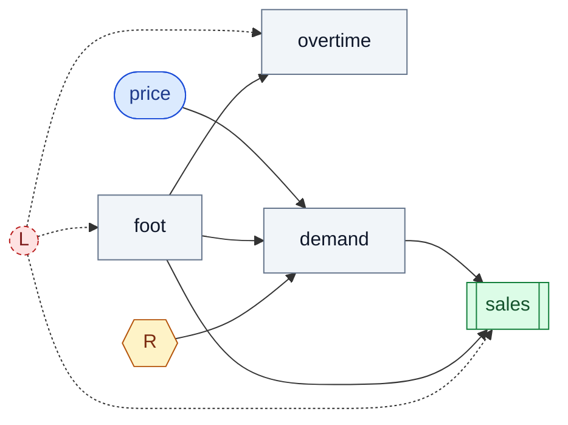

# Examples

Runnable, self-contained scripts. Each file's docstring includes its **expected output**, so you can
get a feel without running anything. The first four need **no API key**.

```bash
uv run python examples/01_grade_your_discoverer.py
```

| # | Example | Needs keys? | What it shows |
|---|---|---|---|
| 01 | [`01_grade_your_discoverer.py`](01_grade_your_discoverer.py) | no | implement `recover()`, score it vs the answer key |
| 02 | [`02_visualize_a_world.py`](02_visualize_a_world.py) | no | render the SCM as Mermaid; read the answer key |
| 03 | [`03_benchmark_a_controller.py`](03_benchmark_a_controller.py) | no | score a policy by **regret** vs the by-construction optimum |
| 04 | [`04_inspect_a_bundle.py`](04_inspect_a_bundle.py) | no | load a shipped world; read its truth + provenance |
| 05 | [`05_author_a_world.py`](05_author_a_world.py) | **yes** (`[llm]`) | natural language → an admitted causal world |

## 01 — grade your discoverer

```text
naive correlation : Report(directed_shd=3, skeleton_shd=3, f1=0.73, n_truth=6, n_recovered=5, confounded_reported=1)
interventional-ci : Report(directed_shd=0, skeleton_shd=0, f1=1.0, n_truth=6, n_recovered=6, confounded_reported=0)

correlation keeps 1 spurious confounded edge(s) as causal;
the interventional grader keeps 0 — that gap is the point.
```

## 02 — visualize a world

`to_mermaid(spec)` emits a diagram that renders natively on GitHub (the hidden confounder `L` is
dashed — it is never in the data):



```text
answer key: 6 causal edges, 1 hidden-confounded pair(s)
confounded (no direct edge, shared hidden cause): overtime ~ sales
```

(Or from the CLI: `causal-worlds viz coffee` — add `--format dot` for Graphviz.)

## 03 — benchmark a controller

```text
optimal policy (declared): {'price': 0.0}
your policy {'price': 3.0}  -> regret 4.502   (0 = optimal play)
optimal policy itself       -> regret 0.000
```

## 04 — inspect a bundle

```text
world: benchmark/v0.6/world_01
  prompt          : A hospital emergency department with triage staffing, inflow, beds, and wait times.
  observed columns: ('triage_nurses', 'patient_inflow', 'beds_open', 'wait_time', ...)
  data shape      : (2000, 7)  (rows x observed)
  causal edges    : [('beds_open', 'los_hours'), ('boarding_pressure', 'triage_nurses'), ...]
  confounded pairs: [['beds_open', 'patient_inflow']]  (NOT causal edges)
  difficulty      : name=0.78 structural=2.0
  provenance      : author=claude-opus-4-8 judge=gemini-2.5-flash grader=interventional-ci
  honesty         : Fictional world for benchmarking causal discovery; not a model of any real system.
```

## 05 — author a world (needs `[llm]` + `ANTHROPIC_API_KEY` + `GEMINI_API_KEY`)

```text
admitted in 2 attempt(s)
  observed : ['surge_multiplier', 'driver_supply', 'rider_demand', 'cancellations', 'churn']
  hidden   : ['L_market_heat']
  difficulty 0.62  faithfulness 0.90
  reference grader: directed_shd=1 f1=0.86
```

_(illustrative — a real authoring run depends on the live models)_
